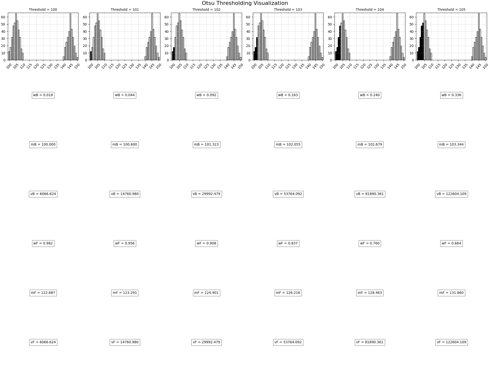
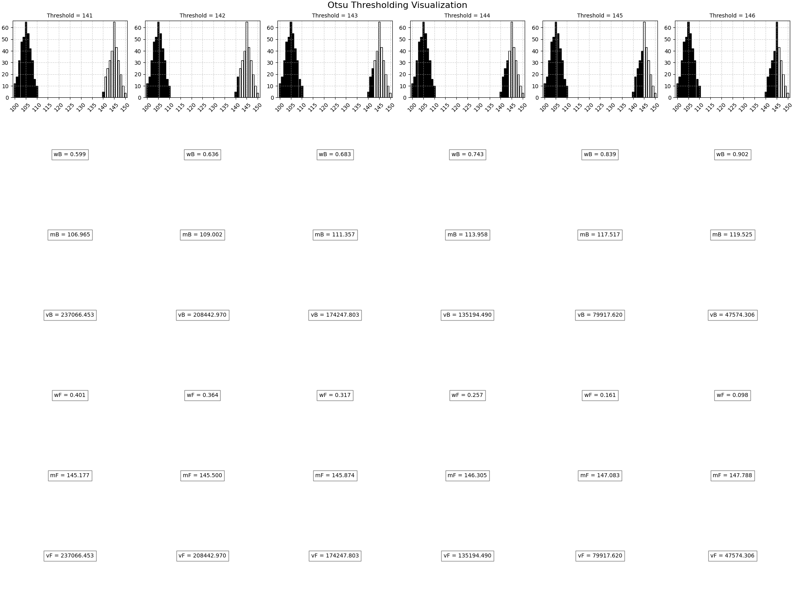
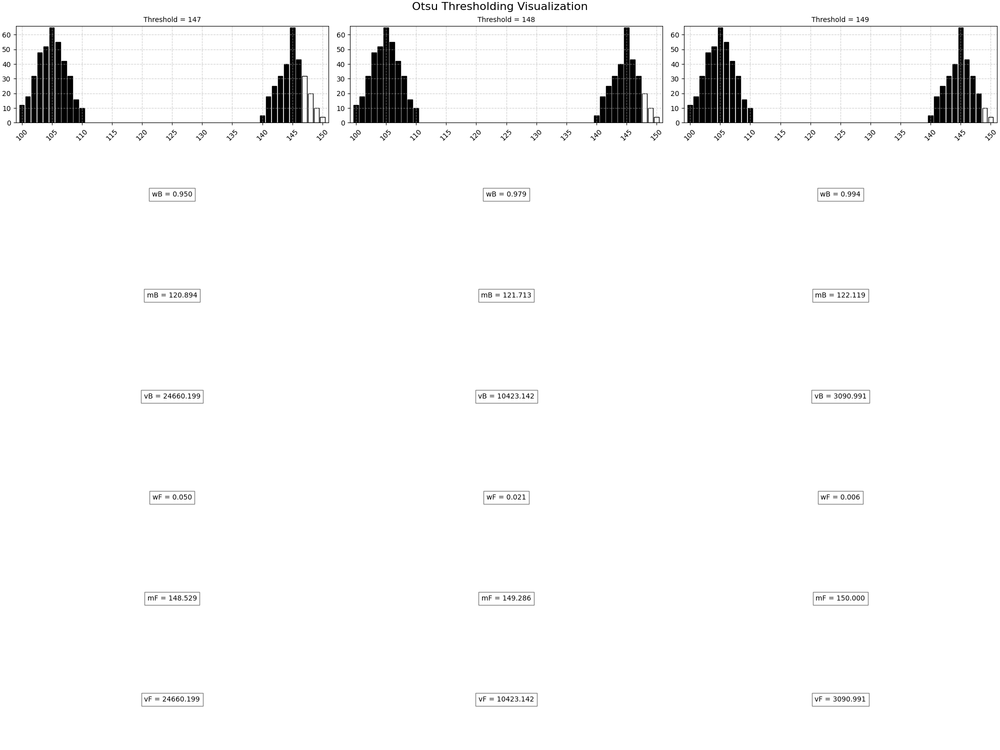

# 📊 Otsu Thresholding Script

This repository contains a Python script for determining the optimal threshold value for image histogram data using Otsu's method.

## 📋 Table of Contents
- [📖 Description](#-description)
- [✨ Features](#-features)
- [🛠️ Requirements](#-requirements)
- [💾 Installation](#-installation)
- [🚀 Usage](#-usage)
- [📝 Example](#-example)
- [🙏 Acknowledgements](#-acknowledgements)

## 📖 Description

The script calculates the optimal threshold value for a given image histogram using Otsu's method. Otsu's method divides the histogram into two classes based on an initial threshold value, calculates the mean intensity values for each class, and iteratively adjusts the threshold until it converges.

## ✨ Features

- Calculates the optimal threshold value for image histogram data using Otsu's method.
- Visualizes the histogram and the calculated values for each threshold.

## 🛠️ Requirements

- Python 3.x
- numpy
- matplotlib

## 💾 Installation

1. Clone the repository:
   ```sh
   git clone https://github.com/Renanuya/otsu-tresholding-python.git
   cd thresholding-script
   ```

2. Install the required Python packages:
   ```sh
   pip install numpy matplotlib
   ```

## 🚀 Usage

1. Place your input histogram data in the script.

2. Run the script:
   ```sh
   python main.py
   ```

3. The script will process the data and print the optimal threshold value.

## 📝 Example

When the script is executed, it performs the following steps:

1. Reads the histogram data from the predefined dictionary.
2. Applies Otsu's method to calculate the optimal threshold.
3. Prints the optimal threshold value and visualizes the histogram along with calculated values.

Here is a simplified view of the input and output data:

- **Input Histogram Data** (example):
```python
histogram = {
    100: 12, 101: 18, 102: 32, 103: 48, 104: 52, 105: 65, 106: 55, 107: 42, 108: 32, 109: 16,
    110: 10, 140: 5, 141: 18, 142: 25, 143: 32, 144: 40, 145: 65, 146: 43, 147: 32, 148: 20,
    149: 10, 150: 4
}
```

- **Output Optimal Threshold** (example):
```
Optimal Threshold: 110
```

- **Visualization Output** (example):




## 🙏 Acknowledgements

- [numpy](https://numpy.org/)
- [matplotlib](https://matplotlib.org/)

Feel free to reach out if you have any questions or need further assistance!